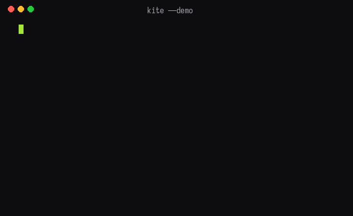

# Kite

A fast, minimal static site generator written in Go. Transform Markdown files into beautiful, themed websites with zero dependencies at runtime.

<p>
  
  
</p>



## Website

Docs and landing page live at **https://kite.himanshu.co** — source in [`website/`](website/) (built with kite itself).

## Installation

```bash
go install github.com/HimanshuSardana/kite@latest
```

## Usage

### Initialize a New Blog

```bash
kite init
```

This interactive command walks you through:
- Blog name and site title
- Author information
- Theme selection
- Creates `content/`, `output/`, `themes/` directories
- Generates config and a sample post

### Build Your Site

```bash
kite build
```

Or specify a theme:

```bash
kite build gruvbox
```

### Preview Locally

```bash
kite serve
```

Visit `http://localhost:8000` to see your site.

### Static Files

Anything in `static/` is copied as-is to `output/` on every build
(favicons, images, `robots.txt`, extra CSS). `kite serve` watches it too.

### Drafts

`draft: true` in frontmatter hides a post from normal builds.
`kite build --drafts` / `kite serve --drafts` includes it for preview.

### Feeds & Sitemap

Every build regenerates `feed.xml` and `sitemap.xml`, and adds an RSS
autodiscovery `<link>` to each page — no theme changes needed.

## Commands

| Command | Description |
|---------|-------------|
| `kite init` | Initialize a new blog project |
| `kite new hello.md` | Create a post with stamped frontmatter (`--draft` starts it as a draft) |
| `kite build` | Build the static site |
| `kite build <theme>` | Build with a specific theme |
| `kite serve` | Start local development server |
| `kite serve --port 8080` | Serve on custom port |
| `kite list-themes` | Show available themes |
| `kite check` | Check `output/` for broken internal links (exit 1 if any) |

## Configuration

Edit `config.yaml` to customize your site:

```yaml
siteTitle: "Your Blog Name"
authorName: "Your Name"
authorRole: "Writer & Developer"
authorBio: "A short bio about yourself"
defaultTheme: "modern-light"
siteUrl: "https://your-domain.com"
```

## Themes

Kite comes with 10 built-in themes:
- modern-light
- modern-dark
- modern-dark-2
- modern-dark-catppuccin
- everforest
- gruvbox
- rose-pine
- terminal-gruvbox
- tufte
- magical

